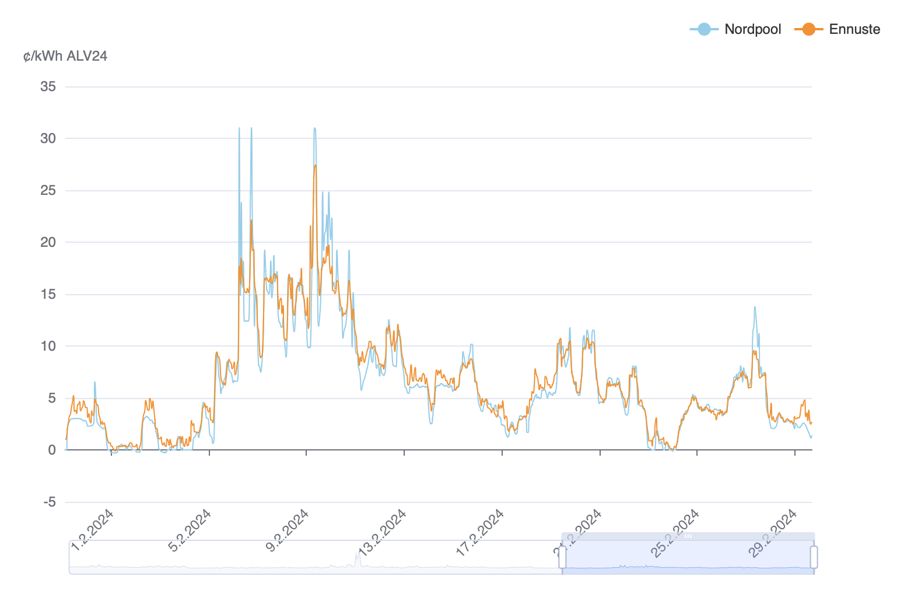

# Nordpool FI Spot Price Prediction

**This is a Python script that predicts electricity prices for the Nordpool FI market. The script fetches a 5-day weather forecast and a wind power forecast, and uses these to predict future Nordpool FI electricity prices, using a trained Random Forest model.**

- Live version: https://sahkovatkain.web.app (soon)

- You can view "Plan B" predictions here: https://nordpool-predict-fi.web.app

If you need the predictions, you'll find them in the [deploy](deploy) folder. See [below](#home-assistant-chart) for Home Assistant instructions. Alternatively, download [index.html](deploy/index.html) from this repository, save it, and open it locally to see the current prediction.

This repository contains all the code and much of the data to re-train the model, generate predictions, express a quantitative model analysis and plot the results.

[TOC]


## Model performance

You can get a general idea of the model's performance from the chart below. **TLDR:** The model is generally aware of the general price levels and patterns for a given day and hour — but it doesn't catch every spike in every detail.

**Legend:** Realized Nordpool price is blue. Model-generated prediction is orange. The Y axis represents market price with VAT 24%, cents per kilowatt-hour (c/kWh). 



## Quantitative metrics

To explain the model's performance in statistical terms, this is what the model predicts, when sampling all of the predictions vs their known Nordpool values. There is currently no "rolling evaluation" that measures the model against its past versions. There is a semi-frequent re-training though, to always include the latest available data.

> - **MAE (Mean Absolute Error): 1.31 cents/kWh**
>   This measures the average magnitude of errors in the model's predictions, without considering their direction. In simple terms, it shows how much, on average, the model's price predictions are off from the actual prices.
>
> - **MSE (Mean Squared Error): 12.01 (cents/kWh)^2**
>   This squares the errors before averaging, which means it gives more weight to larger errors. This metric is useful for identifying whether the model is making any significantly large errors.
>
> - **RMSE (Root Mean Squared Error): 3.47 cents/kWh**
>   This is the square root of MSE, bringing the error units back to the same units as the prices (cents per kWh). It's useful for understanding the magnitude of error in the same units as the target variable.
>
> - **R^2 (Coefficient of Determination): 0.856**
>   This indicates how much of the variance in the actual prices is explained by the model. A score of 1 means the model perfectly predicts the prices, while a score closer to 0 means the model fails to accurately predict the prices.
>
> - **sMAPE (Symmetric Mean Absolute Percentage Error): 36.1%**
>   This provides an intuitive understanding of the average error in percentage terms. It treats overpredictions and underpredictions equally. A value closer to 0% indicates more accurate predictions.
>
> - **Pearson Correlation Coefficient: 0.935**
>   This measures the linear correlation between the actual and predicted prices. A coefficient of 1 indicates a perfect positive linear correlation, meaning the model's predictions perfectly align with the actual prices in a linear fashion.
>
> - **Spearman Rank Correlation Coefficient: 0.964**
>   This assesses how well the relationship between the model's predictions and the actual prices can be described using a monotonic function. It does not assume a linear relationship but rather that the rankings of actual and predicted prices match.
>   
>   (Last updated: 2024-02-29, could be outdated)

The model might be overfit to historical data. Yet its primary function is to predict short-term outcomes, where it has been useful in practice, determining the near-term direction and range quite accurately.  It remains to be seen, how well the model copes over the full year of 2024. See the [model](model) folder for when the model was last trained.

To recalculate these numbers, use the command `python nordpool_predict_fi.py --eval`.

## Co-authors

The original RF model was initially co-trained with [Autogen](https://github.com/microsoft/autogen). GPT-4 was used a lot during coding, but a real human has re-written most of the code and comments by hand, including this README. Originally the project was a personal Autogen + AI pair programming evaluation/trial and a hobby project written over 2 weekends.

In addition to Random Forest, we (human and AI) also tried Linear Regression, GBM and LSTM, and a Random Forest with Linear Regression scaling. Out of these, the RF model performed the best, so that's what's used here.

[Continue.dev](https://github.com/continuedev/continue) was the tool of choice for AI pair programming.

## Usage

Clone the repository, `pip install -r requirements` in a new environment.

```bash
python -m venv venv
source venv/bin/activate
pip install -r requirements.txt
```

The script uses environment variables for configuration. These can be set in a file called `.env.local`. Check  `.env.local.template` [and the comments](.env.local.template) on what the variables are. Most of the defaults should be OK.

How to use:

```
usage: nordpool_predict_fi.py [-h] [--train] [--eval] [--training-stats] [--dump] [--past-performance] [--plot] [--predict] [--add-history] [--narrate] [--commit] [--deploy] [--publish] [--github]

options:
  -h, --help          show this help message and exit
  --train             Train a new model candidate using the data in the database
  --eval              Show evaluation metrics for the current database
  --training-stats    Show training stats for candidate models in the database as a CSV
  --dump              Dump the SQLite database to CSV format
  --past-performance  Generate past performance stats for recent months
  --plot              Plot all predictions and actual prices to a PNG file in the data folder
  --predict           Generate price predictions from now onwards
  --add-history       Add all missing predictions to the database post-hoc; use with --predict
  --narrate           Narrate the predictions into text using an LLM
  --commit            Commit the results to DB and deploy folder; use with --predict, --narrate, --past-performance
  --deploy            Deploy the output files to the deploy folder but not GitHub
  --github            Push the deployed files to a GitHub repo; use with --deploy
```

See the data/create folder for a set of DB initialization scripts if you need them. You may need to fetch some of the data sets from their original sources.

### How to run locally

First make sure you've installed the requirements from requirements.txt.

1. Update the price forecast, narrate it, update the SQLite database and json/md outputs: `python nordpool_predict_fi.py --predict --narrate --commit`

   Optionally, you can do a retrospective update to the PricePredict field for the whole DB by including `--add-history` into the command line above.

   This sequence fetches the last known history and forecasts for wind power, temperature, nuclear power and spot prices and constructs a data frame out of them, ready to be committed to the database, again extending it by a few days.

   At this point your database (data/prediction.db) will get written with a new set of data. Take a copy of prediction.db just to be sure.

2. `python nordpool_predict_fi.py --publish` fetches the latest data from the DB and creates a set of files in the deploy folder. It also tries to update this Github repo, but that will probably fail by design, given that you don't have the keys for that.

   At this point you should have an updated set of .json files in your `deploy` folder. To know what they are, read up on [deploy/README.md](deploy/README.md).

3. Open `index.html` from the `deploy` folder locally in your browser

## How does this model work?

Surpisingly, this model (or problem) is **not** a time series prediction. Price now doesn't tell much about price in 2 hours before or after. Just look at the shape of the chart above.

Following intuition and observing past price fluctuations, outdoor temperature can hedge much of the price-impacting demand and wind can hedge much of the price-impacting supply, if the supply side is *otherwise* working as-usual on any given day. What if we ignore all the other variables and see what happens if we just follow the wind?

The idea here was to formalize that intuition through a data set and a model.

* A set of FMI weather stations near wind power clusters to measure wind speed, a predictor for wind power
* Another set near urban centers to measure wind speed, a predictor for consumption due to heating 

- Since the day of the week (Sunday vs. Monday) makes a difference, as does the time of the day (3 AM vs. 7 PM), and a month (January vs. July), those too were included as variables. But the day-of-the-month was not, because all it says is likely already captured by the weather, the time and the weekday.

- Nuclear power production data is included post-hoc and near future is inferred from last known values. Planned or unplanned maintenance break can offset a large amount of supply that wind power then needs to replace. The model reacts to these with a few hours a delay, as the drop becomes apparent in the input data.

Data schema used for training and inference is this:

```
CREATE TABLE prediction (
    timestamp TIMESTAMP PRIMARY KEY,
    "ws_101256" FLOAT,
    "ws_101267" FLOAT,
    "ws_101673" FLOAT,
    "ws_101846" FLOAT,
    "t_101118" FLOAT,
    "t_101339" FLOAT,
    "t_101786" FLOAT,
    "t_100968" FLOAT,
    "WindPowerCapacityMW" FLOAT,
    "NuclearPowerMW" FLOAT,
    "Price_cpkWh" FLOAT,
    "PricePredict_cpkWh" FLOAT
);
```

The columns starting with `t_` and `ws_` are [FMSIDs](https://www.ilmatieteenlaitos.fi/havaintoasemat?filterKey=groups&filterQuery=sää) of the FMI weather stations nearest to the locations of interest. They offer both observations and forecasts that have a high correlation with each other post-hoc. As a side effect of this approach, the repository also contains [functions](util/fmi.py) for working with FMI history/forecast queries.

### Hidden patterns in weather/price data

As code, the price information is learned from, or is a function of, patterns and correlations between the above factors, as learned by the model.

> **Example scenarios to illustrate the correlations:**
>
> - Early Spring Morning: 3°C at 5 AM with 2 m/s wind speed - Expected Price: 6 to 10 cents/kWh due to moderate heating demand and low wind energy contribution.
> - Chilly Fall Evening: 8°C at 6 PM with 1 m/s wind speed - Expected Price: 5 to 8 cents/kWh, increased demand for heating with minimal wind energy supply.
> - Cold Winter Night: -12°C at 2 AM with 4 m/s wind speed - Expected Price: 12 to 18 cents/kWh due to high heating demand, partially offset by moderate wind generation.
> - Mild Spring Afternoon: 16°C at 3 PM with 5 m/s wind speed - Expected Price: 3 to 5 cents/kWh, a balance of mild demand and good wind supply.
> - Cool Autumn Midnight: 6°C at 11 PM with 6 m/s wind speed - Expected Price: 1 to 3 cents/kWh, low demand and high wind energy generation.

### What's a Random Forest?

How can a Random Forest model learn these patterns to predict future prices based on future weather? That's a good question. We could ask GPT-4 to see what it says:

> A Random Forest model learns to predict outcomes, such as electricity prices based on weather and other conditions, through a combination of decision trees. Here's how it typically works for understanding and predicting patterns like those in your examples:
>
> 1. **Decision Trees**: At the heart of a Random Forest are decision trees. Each decision tree in the forest is built from a random subset of the data features ('Temp_dC', 'Wind_mps', 'WindPowerMW', etc.) and instances. These trees are grown to their maximum size without pruning, which makes them highly sensitive to the specific data they're trained on, capturing complex patterns including nonlinear relationships and interactions between variables.
>
> 2. **Randomness**: Two levels of randomness are introduced in a Random Forest: 
>    - **Feature Sampling**: When splitting a node, the model randomly selects a subset of the features to consider for the split. This ensures that the trees in the forest are diverse, which reduces the model's variance and helps to avoid overfitting.
>    - **Bootstrap Sampling**: Each tree is trained on a different bootstrap sample of the data (i.e., a sample drawn with replacement), which adds to the diversity among the trees.
>
> 3. **Aggregation (Bagging)**: The predictions from all the trees are aggregated (usually by averaging) to make a final prediction. This process of combining multiple models to improve the overall performance is known as bootstrap aggregating, or bagging. The aggregation reduces the variance without increasing the bias, making the model robust against overfitting and capable of capturing complex patterns in the data.
>
> 4. **Learning Correlations**: In the context of your examples, the Random Forest model would learn the intricate relationships between temperature, wind speed, time of day, and other factors with the electricity prices. Each tree in the forest would capture different aspects of these relationships based on the subset of data and features it's trained on. For instance, one tree might learn the importance of wind power capacity during high-demand periods, while another might focus on the impact of temperature during different seasons.
>
> 5. **Feature Importance**: An additional benefit of using Random Forests is that they can provide insights into the importance of each feature in predicting the outcome. In your case, this could help identify which factors (e.g., temperature, wind speed, time of day) are most influential in determining electricity prices.
>
> The Random Forest algorithm is particularly well-suited for this kind of prediction task because it can handle complex, nonlinear relationships between variables and is robust against overfitting. It achieves this by learning from the collective insights of multiple decision trees, each of which may capture different underlying patterns and correlations in the data.

That's a lot of hidden complexity that happens during the about 2 seconds it takes to re-train the model with the data. [It doesn't need a lot of code though.](util/train.py#L49)

## How long will this repository/data be updated?

**This is a hobby project, there is no guarantee to keep the code or data up to date in the long haul. That's why all the code is free and public.** All the data is free and public too, but the Nordpool spot data used by this repo can't be used for commercial purposes. Feel free to fork the project and make it your own, or submit a pull request. I'm using these predictions myself and plan to keep this code working as a hobby project, until there's a new and more important hobby project.

# How to use the data in your apps

## Local web page

If you download [index.html](deploy/index.html) and open it locally, it will draw the latest data in a nice format at runtime using eCharts. This is the same page which can be found at https://sahkovatkain.web.app.

## Python sample script

Pending an API, there's a sample script [deploy/npf.py](deploy/npf.py) to demonstrate how to fetch [prediction.json](deploy/prediction.json), convert it into a Pandas dataframe and save it to a CSV file.

## Home Assistant

You can show the Nordpool prices with predictions on your dashboard. The code uses official Nordpool prices for today and tomorrow (when available) and fills the rest of the chart with prediction data, as seen at the top of this README.

> [!NOTE]
>
> After 14:00, the "tomorrow" prices may show up empty for a while, until Nordpool publishes tomorrow's pricing and your Home Assistant gets a note of them now being available. Feel free to propose a more intelligent logic for the chart and submit a PR.

### Requirements

- [HACS](https://hacs.xyz), Home Assistant Community Store, which you can get from the [Add-On store](https://www.home-assistant.io/addons/), or follow the [docs](https://hacs.xyz/docs/setup/download/)

- [custom:apexcharts-card](https://github.com/RomRider/apexcharts-card) (available through HACS)
- [Nordpool integration](https://github.com/custom-components/nordpool), set to EUR VAT0 prices (available through HACS)
    - Adjust the sensor names to match yours: `sensor.nordpool_kwh_fi_eur_3_10_0`
    - Remove the "124" multiplication from your code, if your sensor already produces cent values with VAT

### Add the card to your dashboard

Add the contents of [deploy/npf.yaml](deploy/npf.yaml) as a "Manual" chart to your Lovelace dashboard. An alternative [deploy/npf2.yaml](deploy/npf2.yaml) shows the Nordpool vs prediction series in a different way. Choose the visual variation you prefer.

## License

This project is licensed under the MIT License.

