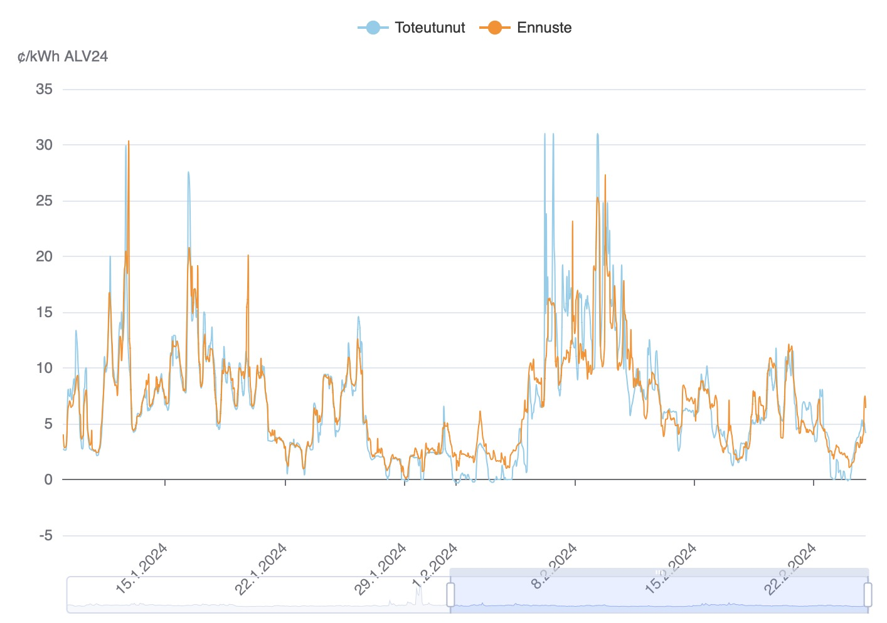

# Nordpool FI Spot Price Prediction

**This is a Python script that predicts electricity prices for the Nordpool FI market. The script fetches a 5-day weather forecast and a wind power forecast, and uses these to predict future Nordpool FI electricity prices, using a trained Random Forest model.**

> [!NOTE]
>
> **2024-02-28**: The 10-day wind power forecast is not available as a free/open data source for public predictions (terms & conditions accommodate for private consumption only), so the live version is down until a useful plan B is implemented. Work is in progress. Much of this README could be outdated until then.

~~Live version: [https://nordpool-predict-fi.web.app](https://nordpool-predict-fi.web.app)~~

~~If you need the predictions, you'll find them in the [deploy](deploy) folder. See [below](#home-assistant-chart) for Home Assistant instructions. Alternatively, download [index.html](deploy/index.html) from this repository, save it, and open it locally to see the current prediction.~~

This repository contains all the original data and code to re-train the model, generate predictions, express a quantitative model analysis and plot the results.

[TOC]


## Model performance

You can get a general idea of the model's performance from the chart below. **TLDR:** The model is generally aware of the general price levels and patterns for a given day and hour — but it doesn't catch every spike in every detail.

**Legend:** Realized market price is blue. Model-generated prediction is orange. Y axis represents Nordpool FI marker price with VAT 24%, cents per kilowatt-hour (c/kWh). 



## Quantitative metrics

To explain the model's performance in statistical terms, this is what the model predicts, when sampling 500 random hours from the whole data set (train + test set) and then doing that 10 times. Measuring vs. test-set-only produces results in the same ballpark, with R² around ~0.8.

> - **Mean Absolute Error (MAE) of 0.997:** This measurement tells us that, on average, the model's price predictions are off by just under one unit (cents). This level of accuracy implies that if you use this model to estimate prices, your predictions would typically be less than one cent away from the actual price. 
> - **Mean Squared Error (MSE) of 6.08:** MSE provides insight into the average squared difference between the predicted and actual values, emphasizing larger errors more significantly.
> - **R² Score of 0.888:** The R² value, which can range from 0 to 1, measures the model's ability to predict future outcomes based on past data. An R² score close to 0.888 means the model successfully captures about 89% of the variability in the actual prices with its predictions.
> - **Pearson Correlation Coefficient: 0.955:** This measures the linear correlation between the actual and predicted prices. A coefficient of 1 indicates a perfect positive linear correlation.
> - **Spearman Rank Correlation Coefficient: 0.973:** This assesses how well the relationship between the model's predictions and the actual prices can be described using a monotonic function. It does not assume a linear relationship but rather that the rankings of actual and predicted prices match.

The model might be overfit to historical data. Yet its primary function is to predict short-term outcomes, where it has been useful in practice, determining the near-term direction and range quite accurately.  It remains to be seen, how well the model copes over the full year of 2024. See the [model](model) folder for when the model was last trained.

To recalculate these numbers, use the command `python nordpool_predict_fi.py --eval`.

## Co-authors

The original RF model was initially co-trained with [Autogen](https://github.com/microsoft/autogen). GPT-4 was used a lot during coding, but a real human has re-written most of the code and comments by hand, including this README. Originally the project was a personal Autogen + AI pair programming evaluation/trial and a hobby project written over 2 weekends.

In addition to Random Forest, we (human and AI) also tried Linear Regression, GBM and LSTM, and a Random Forest with Linear Regression scaling. Out of these, the RF model performed the best, so that's what's used here.

[Continue.dev](https://github.com/continuedev/continue) was the tool of choice for AI pair programming.

## Usage

Clone the repository, `pip install -r requirements` in a new environment.

```bash
python -m venv venv
source venv/bin/activate
pip install -r requirements.txt
```

The script uses environment variables for configuration. These can be set in a file called `.env.local`. Check  `.env.local.template` [and the comments](.env.local.template) on what the variables are. Most of the defaults should be OK.

How to use:

```
options:
  -h, --help          show this help message and exit
  --dump              Dump the SQLite database to CSV format
  --plot              Plot all predictions and actual prices to a PNG file in the data folder
  --foreca            Update the Foreca wind power prediction file
  --fingrid           Update missing nuclear power data
  --predict           Generate price predictions from now onwards
  --add-history       Add all missing predictions to the database post-hoc; use with --predict
  --narrate           Narrate the predictions into text using an LLM
  --past-performance  Generate past performance stats for 30 days
  --commit            Commit the results to DB and deploy folder; use with --predict, --narrate, --past-performance
  --publish           Publish the deployed files to a GitHub repo
  --train             Train a new model candidate using the data in the database
  --eval              Show evaluation metrics for the current database
  --training-stats    Show training stats for candidate models in the database as a CSV
```

See the data folder for a DB initialization script if you need it. ~~This repo includes a pre-populated database.~~

### How to run locally

First make sure you've installed the requirements from requirements.txt.

1. Update the wind power production forecast json file: `python nordpool_predict_fi.py --foreca`
2. Update the price forecast, narrate it, update the SQLite database and json/md outputs: `python nordpool_predict_fi.py --predict --narrate --commit`

   At this point you should have an updated set of files in your `deploy` folder

3. Open `index.html` from the `deploy` folder locally in your browser

## How does this model work?

Surpisingly, this model (or problem) is **not** a time series prediction. Price now doesn't tell much about price in 2 hours before or after. Just look at the shape of the chart above.

Following intuition and observing past price fluctuations, outdoor temperature can hedge much of the price-impacting demand and wind can hedge much of the price-impacting supply, if the supply side is *otherwise* working as-usual on any given day. What if we ignore all the other variables and see what happens if we just follow the wind?

The idea here was to formalize that intuition through a data set and a model.

- Foreca produces a [public wind power forecast](https://www.foreca.fi/sahkon-hinta) for 10 days ahead. This data is part of the training and predictions.

- Temperature affects household energy consumption. I selected Tampere/Pirkkala Airport as a representative metropolitan location for temperature/wind measurements. If it's very cold and windy there, perhaps it's also very cold and windy in Oulu, Turku, Helsinki etc., which would balloon country-wide household energy consumption, and this should show up in correlations, if not offset by the available wind.

- Max available wind power capacity was included, because the capacity is constantly growing, and including this information made the past pricing data explain more about the price at the time.

- Since the day of the week (Sunday vs. Monday) makes a difference, as does the time of the day (3 AM vs. 7 PM), and a month (January vs. July), those too were included as variables. But the day-of-the-month was not, because all it says is likely already captured by the weather, the time and the weekday.

- In a later commit, nuclear power production data was included. Planned or unplanned maintenance break can offset a large amount of supply that wind power then needs to replace.

Data schema used for training and inference is this:

```
sqlite> .schema
CREATE TABLE prediction (
    timestamp TIMESTAMP PRIMARY KEY,
    "Price_cpkWh" FLOAT,
    "Temp_dC" FLOAT,
    "Wind_mps" FLOAT,
    "WindPowerMW" FLOAT,
    "WindPowerCapacityMW" FLOAT,
    "PricePredict_cpkWh" FLOAT,
    "NuclearPowerMW" FLOAT
);
```

### Hidden patterns in weather/price data

As code, the price information is learned from, or is a function of, patterns and correlations between these factors, as learned by the model:

```
['Temp_dC', 'Wind_mps', 'WindPowerMW', 'WindPowerCapacityMW', 'hour', 'day_of_week', 'month', 'NuclearPowerMW']
```

> **Example scenarios to illustrate the correlations:**
>
> - Early Spring Morning: 3°C at 5 AM with 2 m/s wind speed - Expected Price: 6 to 10 cents/kWh due to moderate heating demand and low wind energy contribution.
> - Chilly Fall Evening: 8°C at 6 PM with 1 m/s wind speed - Expected Price: 5 to 8 cents/kWh, increased demand for heating with minimal wind energy supply.
> - Cold Winter Night: -12°C at 2 AM with 4 m/s wind speed - Expected Price: 12 to 18 cents/kWh due to high heating demand, partially offset by moderate wind generation.
> - Mild Spring Afternoon: 16°C at 3 PM with 5 m/s wind speed - Expected Price: 3 to 5 cents/kWh, a balance of mild demand and good wind supply.
> - Cool Autumn Midnight: 6°C at 11 PM with 6 m/s wind speed - Expected Price: 1 to 3 cents/kWh, low demand and high wind energy generation.

### What's a Random Forest?

How can a Random Forest model learn these patterns to predict future prices based on future weather? That's a good question. We could ask GPT-4 to see what it says:

> A Random Forest model learns to predict outcomes, such as electricity prices based on weather and other conditions, through a combination of decision trees. Here's how it typically works for understanding and predicting patterns like those in your examples:
>
> 1. **Decision Trees**: At the heart of a Random Forest are decision trees. Each decision tree in the forest is built from a random subset of the data features ('Temp_dC', 'Wind_mps', 'WindPowerMW', etc.) and instances. These trees are grown to their maximum size without pruning, which makes them highly sensitive to the specific data they're trained on, capturing complex patterns including nonlinear relationships and interactions between variables.
>
> 2. **Randomness**: Two levels of randomness are introduced in a Random Forest: 
>    - **Feature Sampling**: When splitting a node, the model randomly selects a subset of the features to consider for the split. This ensures that the trees in the forest are diverse, which reduces the model's variance and helps to avoid overfitting.
>    - **Bootstrap Sampling**: Each tree is trained on a different bootstrap sample of the data (i.e., a sample drawn with replacement), which adds to the diversity among the trees.
>
> 3. **Aggregation (Bagging)**: The predictions from all the trees are aggregated (usually by averaging) to make a final prediction. This process of combining multiple models to improve the overall performance is known as bootstrap aggregating, or bagging. The aggregation reduces the variance without increasing the bias, making the model robust against overfitting and capable of capturing complex patterns in the data.
>
> 4. **Learning Correlations**: In the context of your examples, the Random Forest model would learn the intricate relationships between temperature, wind speed, time of day, and other factors with the electricity prices. Each tree in the forest would capture different aspects of these relationships based on the subset of data and features it's trained on. For instance, one tree might learn the importance of wind power capacity during high-demand periods, while another might focus on the impact of temperature during different seasons.
>
> 5. **Feature Importance**: An additional benefit of using Random Forests is that they can provide insights into the importance of each feature in predicting the outcome. In your case, this could help identify which factors (e.g., temperature, wind speed, time of day) are most influential in determining electricity prices.
>
> The Random Forest algorithm is particularly well-suited for this kind of prediction task because it can handle complex, nonlinear relationships between variables and is robust against overfitting. It achieves this by learning from the collective insights of multiple decision trees, each of which may capture different underlying patterns and correlations in the data.

That's a lot of hidden complexity that happens during the about 2 seconds it takes to re-train the model with the data. [It doesn't need a lot of code though.](util/train.py#L49)

## How long will this repository/data be updated?

**This is a hobby project, there is no guarantee to keep the code or data up to date in the long haul. That's why all the code and data is free and public.** Feel free to fork the project and make it your own, or submit a pull request. I'm using these predictions myself and plan to keep this code working as a hobby project, until there's a new and more important hobby project.

> [!WARNING]
>
> **The one part of the project which is definitely NOT robust at the moment, is the wind power forecast parser.** The script uses SVG path parsing 🤓 to re-create the Foreca forecast. While this is an *incredibly* fragile way of fetching the data, it works for now, and I have a pretty good idea of *why* it works, so I can fix it later if it breaks.

```
python nordpool_predict_fi.py --foreca
Starting the process to fetch and parse the SVG data from Foreca...
Setting up the browser driver
Opening the web page
Finding the SVG elements
Saving the beautified SVG content to data/foreca_0.svg
Saving the beautified SVG content to data/foreca_1.svg
SVG files have been saved. Closing the web page.
Extracting Bezier paths from the SVG
Interpolating Y values for each X value
Calculating MW values for each Y entry
Extracting datetime for each MW value for plotting
Interpolating the original data to include all hours in the range
Converting to JSON format and UTC time
JSON data has been written to: data/foreca_wind_power_prediction.json
```

### What if the Foreca wind power forecast option goes down?

We also tried the prediction with the naive method of only including Tampere Airport wind speed and temperature history data, because that's available for many days ahead.

- While this didn't result in quite as accurate a model, it was more accurate than most people's guesswork, and perhaps even surprisingly good.

- A surprise was that Tampere/Pirkkala Airport wind situation and wind power production/history don't actually correlate that closely. That's why both are included during training.

- The airport weather data is included to nudge the model to learn the effects of suburban wind/temperature to household electricity (= heating) consumption, with the airport getting the honor of representing "an average suburban spot" in Finland. Perhaps about as many Finnish households are situated to the North of Tampere, as to the South? And also East/West?

- We suspect that the "day of the week" input captures a lot of the price fluctuations caused by business/industry energy consumption.

Feel free to propose a better "average" Finland temp/wind position, region, or (preferred) API!

### "Plan B" performance: if no access to wind power forecast directly

This is the Random Forest performance in such a scenario, aka the initial version of the model:

> - **Mean Absolute Error (MAE)** of **2.30 cents** indicates how close the model's predictions are to the actual prices, with a lower number indicating better accuracy. Essentially, this model's predictions are, on average, 2.30 cents off from the real prices. This is the "normal day" performance.
> - **Mean Squared Error (MSE)** of **22.07 cents** highlights the average squared difference between predicted and actual prices. A high MSE suggests that there are instances where the model's predictions significantly deviate from the actual values, indicating potential outliers or periods of high volatility that the model handles poorly. This is the "very unusual day" performance.
> - **R-squared (R2)** value of **0.77** tells us that 77% of the price variance is explained by the model's inputs. This means the model is relatively good at predicting price changes based on the data it analyzes, though it's not perfect. If the model says that "it's going to be expensive in 3 days", it probably will be.

If the wind power forecast data becomes unavailable in the future, that's plan B.

# How to use the data in your apps

## Local web page

If you download [index.html](deploy/index.html) and open it locally, it will draw the latest data in a nice format at runtime using eCharts. This is the same page which can be found at https://nordpool-predict-fi.web.app.

## Python sample script

Pending an API, there's a sample script [deploy/npf.py](deploy/npf.py) to demonstrate how to fetch [prediction.json](deploy/prediction.json), convert it into a Pandas dataframe and save it to a CSV file.

## Home Assistant

You can show the Nordpool prices with predictions on your dashboard. The code uses official Nordpool prices for today and tomorrow (when available) and fills the rest of the chart with prediction data, as seen at the top of this README.

> [!NOTE]
>
> After 14:00, the "tomorrow" prices may show up empty for a while, until Nordpool publishes tomorrow's pricing and your Home Assistant gets a note of them now being available. Feel free to propose a more intelligent logic for the chart and submit a PR.

### Requirements

- [HACS](https://hacs.xyz), Home Assistant Community Store, which you can get from the [Add-On store](https://www.home-assistant.io/addons/), or follow the [docs](https://hacs.xyz/docs/setup/download/)

- [custom:apexcharts-card](https://github.com/RomRider/apexcharts-card) (available through HACS)
- [Nordpool integration](https://github.com/custom-components/nordpool), set to EUR VAT0 prices (available through HACS)
    - Adjust the sensor names to match yours: `sensor.nordpool_kwh_fi_eur_3_10_0`
    - Remove the "124" multiplication from your code, if your sensor already produces cent values with VAT

### Add the card to your dashboard

Add the contents of [deploy/npf.yaml](deploy/npf.yaml) as a "Manual" chart to your Lovelace dashboard. An alternative [deploy/npf2.yaml](deploy/npf2.yaml) shows the Nordpool vs prediction series in a different way. Choose the visual variation you prefer.

## License

This project is licensed under the MIT License.

