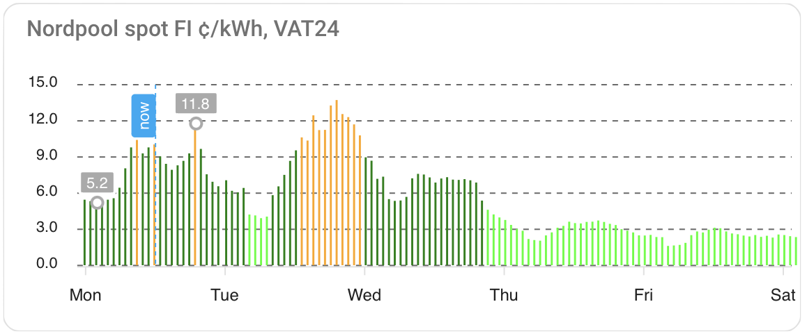

# Nordpool FI Spot Price Prediction

**This is a Python app that predicts electricity prices for the Nordpool FI market. It fetches a 7-day weather forecast and more, and uses them to predict future Nordpool FI electricity prices, using a pair of XGBoost models. Can also work with Random Forest, Gradient Boost, and other decision tree based models.**

Live version: https://sahkovatkain.web.app

If you just want the predictions as raw data, you'll find them in the [deploy](deploy) folder. See [below](#home-assistant-chart) for Home Assistant instructions.

This repository contains all the code and most of the data to train the 2 required models, generate the predictions, and optionally provide an LLM-based narration of the results.

[TOC]



## Background

The repository began as a personal [Autogen](https://github.com/microsoft/autogen) + LLM pair programming evaluation/trial/learning/hobby, written over some weekends. 

All of the code is curated by an actual person, but there may be some AI commentary left in the code. The repository remains an evaluation tool for testing new LLMs and what can be done with them in ML projects. If the output is useful for price prediction, that is definitely a bonus, but this is primarily a playground for tracking the evolution of AI pair programming.

## Updates

**Aug 31, 2024:** After hyperparameter optimization [experiments](data/create/91_model_experiments/) measuring Random Forest, XGBoost, Gradient Boosting, and Light GBM, we're currently running XGBoost by default.

**Sep 17, 2024:** Added a wind power model training and tuning [routine](https://github.com/vividfog/nordpool-predict-fi/tree/main/data/create/91_model_experiments) for wind power predictions. It generates a .joblib file required by `utils/fingrid_windpower.py`. The updated `--predict` routine now consults this model. The same folder has a script for price prediction model tuning with [Optuna](https://github.com/optuna/optuna). Wind power prediction is now an optional extra chart for Home Assistant users, see below.

**Nov 10, 2024:** Replaced Fingrid transmission API with [JAO Border Flow API](https://publicationtool.jao.eu/nordic/maxBorderFlow/) for import capacity information, because Fingrid no longer provides forecast capacity under flow-based calculations. Removed some unused/deprecated utility features.

**Dec 21, 2024:** Wind power model now uses in-memory live training for a hands-free model update just before prediction. For hyperparameter optimization, the older [routines](https://github.com/vividfog/nordpool-predict-fi/tree/main/data/create/91_model_experiments) are still valid.

[Continue.dev](https://github.com/continuedev/continue) was and remains the tool of choice for AI pair programming. The choice of LLMs is a range of locally running and commercial models, typically the latest available and currently under evaluation.

## Usage

Clone the repository, `pip install -r requirements.txt` in a dedicated Python environment:

```bash
python -m venv venv
source venv/bin/activate
pip install -r requirements.txt
```

The repo uses environment variables for configuration. These can be set in a file called `.env.local`. Check  `.env.local.template` [and the comments](.env.local.template) on what the variables are. Most of the defaults should be OK.

How to use:

```shell
usage: nordpool_predict_fi.py [-h] [--predict] [--narrate] [--commit] [--deploy] [--dump]

options:
  -h, --help  show this help message and exit
  --predict   Train a model (in memory) and display price predictions
  --narrate   Narrate the predictions into text using an LLM
  --commit    Commit the predictions/narrations results to DB; use with --predict, --narrate
  --deploy    Deploy the output files to the web folder
  --dump      Dump the SQLite database to CSV format
```

See the `data/create` folders for a set of DB initialization scripts if you need them. You may need to fetch some of the data sets from their original sources. The CSV and SQL database dumps are updated from time to time.

### How to use

First make sure you've installed the requirements from `requirements.txt`. The main script is one flow with multiple optional stops, and you can choose one or many of them in almost any combination.

Examples:

- **Simple usage**: `python nordpool_predict_fi.py --predict` will train a model and display price predictions for 7 days into the past and 7 days into the future, with no commit back to the database. Training happens in-memory and the model file is not saved. This should take a minute or two on a modern CPU. Even a Raspberry Pi is fine for predictions, if model hyperparameter search is done elsewhere.

- **Longer pipeline**: `python nordpool_predict_fi.py --predict --narrate --commit --deploy` will:
  1. Train a new model (in memory) and print evaluation stats,
  2. Use that model to fill or update your price forecast data frame for 7 days into the future,
  3. Use an OpenAI-based LLM to narrate the next 7 days’ forecast,
  4. Commit it all to your local SQLite database,
  5. Deploy JSON and narration MD files to `deploy/`.

- When done, look in the `deploy` folder. You should see `prediction.json` with your newly generated data. If you open `index.html` from the `deploy` folder, you can see a rough chart. For a nicer UI, see the [Home Assistant instructions](#home-assistant).

- The `--predict --commit --deploy` chain also creates a daily “snapshot” JSON file of predictions, which you can use to see how your forecast changed over time. It rotates older snapshots automatically.

- **Check your chart**: `deploy/windpower.json` is similarly created for wind power predictions. Combining these with actual Nordpool data or your own usage data is up to you.

## How does the model work?

Surprisingly for many, the model (or problem) is **not** a pure time-series forecast in the usual sense. Price “now” doesn't say much about price “next hour” in a direct ARIMA-like manner, because the intraday spikes often come from weather or external factors. Instead, we treat each hour’s price as a function of weather, supply, demand, and calendar. That is, the model sees each hour in 2023–2024 as a separate data point with various features (wind speed, nuclear capacity, etc.). This approach is effective in normal circumstances, though outliers can always surprise the model.

Currently, the training data set includes:

- 20 [FMI weather stations](https://www.ilmatieteenlaitos.fi/havaintoasemat?filterKey=groups&filterQuery=sää) to track and forecast **wind speed** (the model uses them, or a sub-model does, to get predicted wind power).
- 20 weather stations for **temperature**, as temperature is a big factor for heating load.
- **Nuclear power** production data (planned vs. unplanned outages from Fingrid and ENTSO-E).
- **Day of week, hour** of day, provided as cyclical features (sin, cos) so the model can “understand” Monday vs. Sunday, or 0:00 vs. 12:00.
- **Import capacity** from Sweden (SE1, SE3) and Estonia (EE), from JAO’s border flow data.
- **Solar irradiation** from Open-Meteo’s data, which may help in certain hours or seasons.

### Hidden patterns in weather/price data

The model tries to find and exploit correlations:

- Low wind in a high-demand season -> higher price
- Transmission line capacity down -> price might rise
- Overlapping nuclear maintenance -> price might spike
- Warm weather and windy -> lower price
- and so on...

These are discovered automatically by XGBoost from historical examples.

## How long will this repository/data be updated?

**This is a hobby project.** There is no guarantee we’ll keep everything up to date forever. That’s why all the code and data are free and public. Feel free to fork the project, submit PRs, or adapt it to your needs.

## How to use the data in your apps

### Python sample script

If you’d like to get the predictions from `deploy/prediction.json`, see [deploy/npf.py](deploy/npf.py). That script fetches `prediction.json`, converts it into a DataFrame, and prints or saves it. The file is basically `[ [<timestamp ms>, <price c/kWh>], ... ]`.

### Home Assistant

You can show Nordpool prices with predictions on your dashboard. This code merges official Nordpool prices for today and tomorrow (when available) with predicted data for the upcoming hours.

#### Requirements

- [HACS](https://hacs.xyz) + [custom:apexcharts-card](https://github.com/RomRider/apexcharts-card)  
- [Nordpool integration](https://github.com/custom-components/nordpool), set to EUR VAT0 or your preference. Adjust sensor names accordingly.

#### Add the card

Use the “Manual” card approach in Lovelace, copy-pasting from [deploy/npf.yaml](deploy/npf.yaml) or [deploy/npf2.yaml](deploy/npf2.yaml). They show two ways to overlay actual vs. predicted. For wind predictions, see [deploy/npf_windpower.yaml](deploy/npf_windpower.yaml).

## Adding a new data source

The code is structured so that each new data source or new column is updated by a separate function, like `update_solar` or `update_windpower`. See them in the `util` folder. The main script calls them in a chain:

```python
df = update_spot(df)
df = update_holidays(df)
df = update_solar(df)
df = update_eu_ws(df)
...
```

Each function merges data for the next 7 days (and some historical range) onto the same DataFrame. The final combined DataFrame is passed to the training and prediction routine.

1. **Add your new column** (e.g. “SomeExternalFactorMW”) to the `prediction.db` file for all past timestamps.
2. **Create** a function that fetches or infers future data for that column, so that the model can use it in the next 7 days as well.
3. **Add** that function to the chain so that your new column is filled before the training and prediction. 
4. **Retune** hyperparameters if you want the best accuracy.

If you need more detail, see the example code in `util/fingrid_windpower.py`, `util/openmeteo_solar.py`, etc.

## License

This project is licensed under the MIT License. It is a hobby project, offered as-is.  

Please feel free to copy or adapt. A mention or link back here is always appreciated, but not required.  